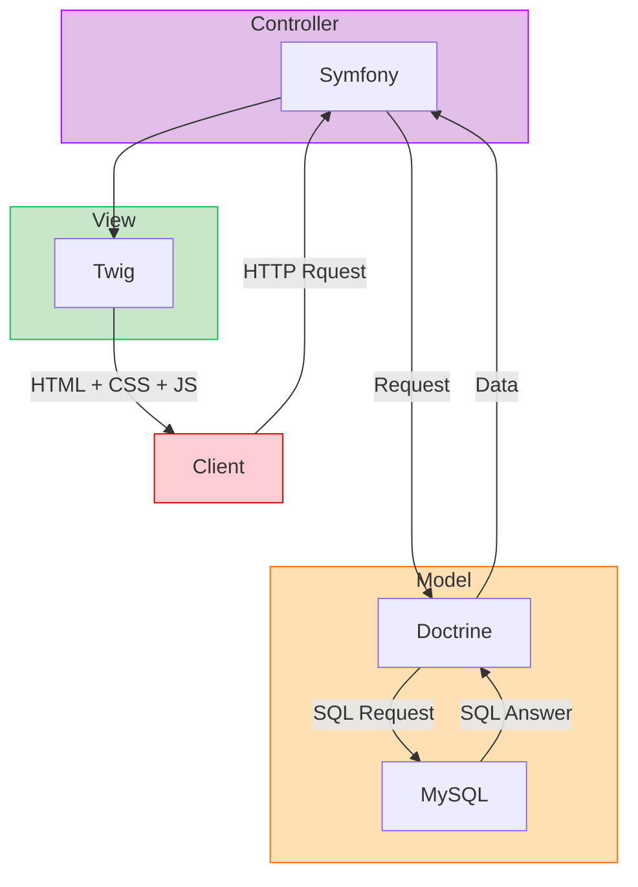
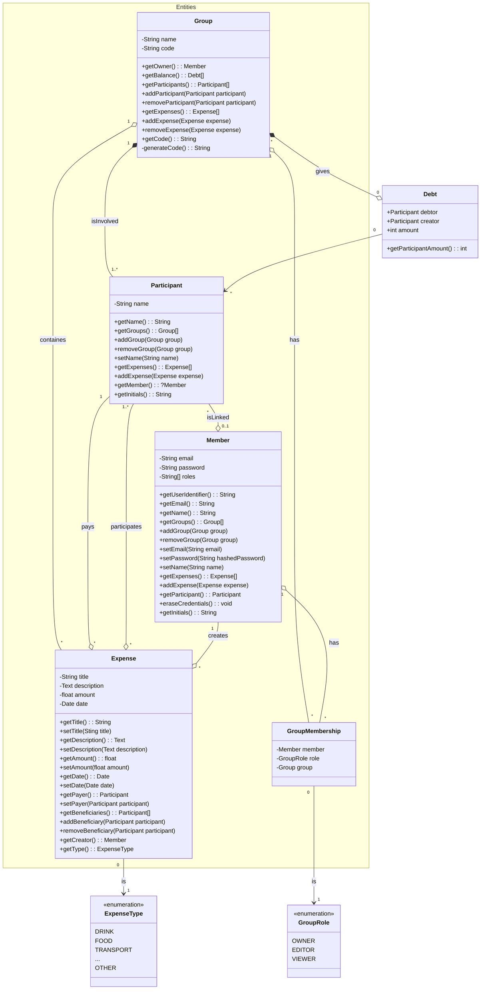

# Technical sheet

***Qui Paie Quoi*** (*Who Pays What*) is a web app to share its expenses with other Members and get the balance of who owes who and how much.

## Context

This is a training project for new apprentices at KNP Labs.

## Stack

### Environement

- **Docker + Docker-compose:** To manage needed tools easily and achieve fast deployment, for both dev and prod environment.
- **PHP:** Needed to run symfony apps.
- **MySQL:** We'll need to store data, but not much so a small and basic SQL relational database fit our needs.
- **Nginx:** Simple web server.
- **Make:** Used for useful commands to save time.
- **Adminer *(only dev)* :** Useful for viewing / debugging / changing data of the database during development.

### Back-end

- **Symfony:** We chose Symfony 7 for our fullstack web application as framework because it is maintainable, well structured and well-known by KNPeers.
- **Doctrine:** Links our app to the database, no matter what kind it is (MySQL or others).

### Front-end

- **Twig:** As a fullstack app, we'll use the basic tool provided by Symfony.
- **Bootstrap:** To implement the different parts of the views we'll use this framework which gives premade basic components.

## Architecture

*Fullstack architecture*

*Class diagram*

## Test

For the moment, the tests are left out (seen with the team), but we'll use those:
- **PHPspec:** Unit tests
- **Behat:** Behavior Driven Development

## Risky beginnings

| Risks | Symfony (fullstack) |
| --- | :---: |
| Unstable | - |
| Need to learn, to acquire skill | - |
| Poorly documented | - | - |
| Not maintained anymore | - |
| Never used at KNP | - |
| Hard to test/lack test tooling | - |
| No KNPeers interested in learning it | - |
| Team members never worked together | + |
| Inexperienced devs | + |

- *- = no risk*
- *+ = risk*
- *++ = big risk*
- *+++ = too risky*
